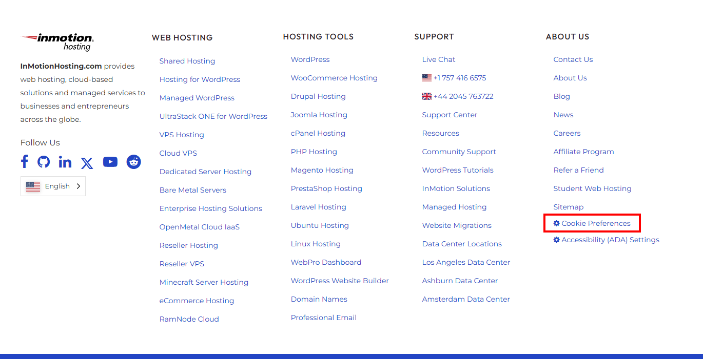
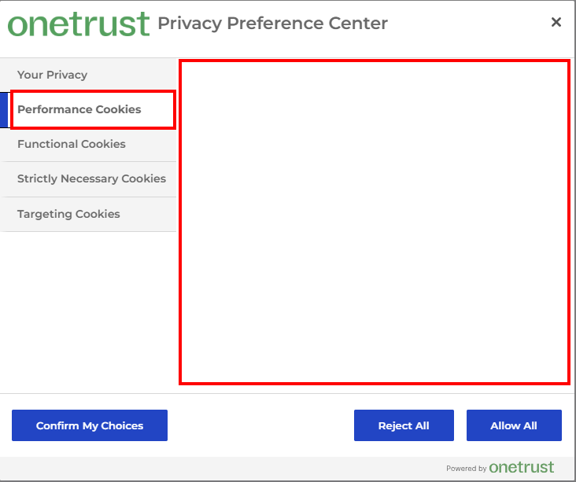
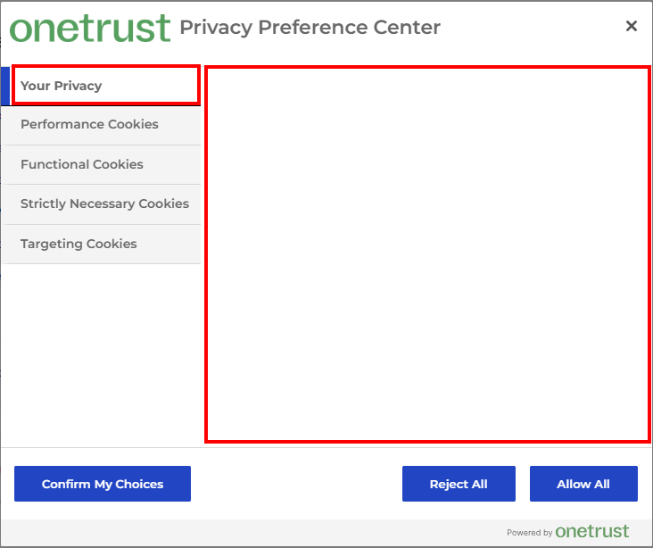

# Bug Report: Cookie Preferences Popup Lacks Specific Cookie Items

**ID:** IMH-CP-001  
**Reported By:** QA Team  
**Date:** November 2025  
**Status:** Open  
**Component:** Compliance / Footer / Cookie Consent (OneTrust)

## Description
When clicking the "Cookie Preferences" link in the footer, the "Privacy Preference Center" popup opens. However, the tabs for specific cookie categories (Performance, Targeting, etc.) **do not list any specific cookies**. Users can see a general description and a toggle, but cannot view or manage individual cookies, which is standard behavior for OneTrust integrations and required for full transparency.

## Environment
- **URL:** [https://www.inmotionhosting.com](https://www.inmotionhosting.com) (Reproducible on all pages)
- **Browser:** Chrome (Latest)
- **OS:** Windows 10/11
- **Device:** Desktop

## Steps to Reproduce
1. Navigate to any page (e.g., [https://www.inmotionhosting.com](https://www.inmotionhosting.com)).
2. Scroll to the footer.
3. Click the **"Cookie Preferences"** link (usually under "About Us" or separate menu).
4. In the popup, click on the **"Performance Cookies"** or **"Targeting Cookies"** or **"Your Privacy"** tab. (Any tab will do, they are all empty.)
5. Observe the content within the tab panel.

## Expected Result
The popup should display a list of specific cookies under each category, allowing users to see "Cookie Subgroup", "Cookies", and "Cookies used" (or similar).

## Actual Result
The tabs display only a generic description and a toggle switch. **No specific cookie list is rendered.**

## Severity / Priority
- **Severity:** Medium (User can still toggle categories, but transparency is compromised)
- **Priority:** High (Compliance risk; potential GDPR/CCPA concern if specific disclosure is required)

## Screenshots

### Screenshot 0: Website Footer with Cookie Preferences Link
**Description:** Snapshot of the website footer with the "Cookie Preferences" link highlighted.  

### Screenshot 1: Performance Cookies Tab (Empty List)
**Description:** Snapshot of the "Performance Cookies" tab showing description but missing cookie list.

### Screenshot 2: Your Privacy Tab (Empty List)
**Description:** Snapshot of the "Your Privacy" tab showing description but missing cookie list.

## Additional Notes
- **Console Logs:** No specific errors observed in console regarding OneTrust loading.
- **Integration:** Likely a configuration setting in the OneTrust console ("Show Cookie List" might be disabled) or a CSS hiding issue.

---