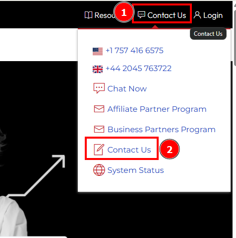
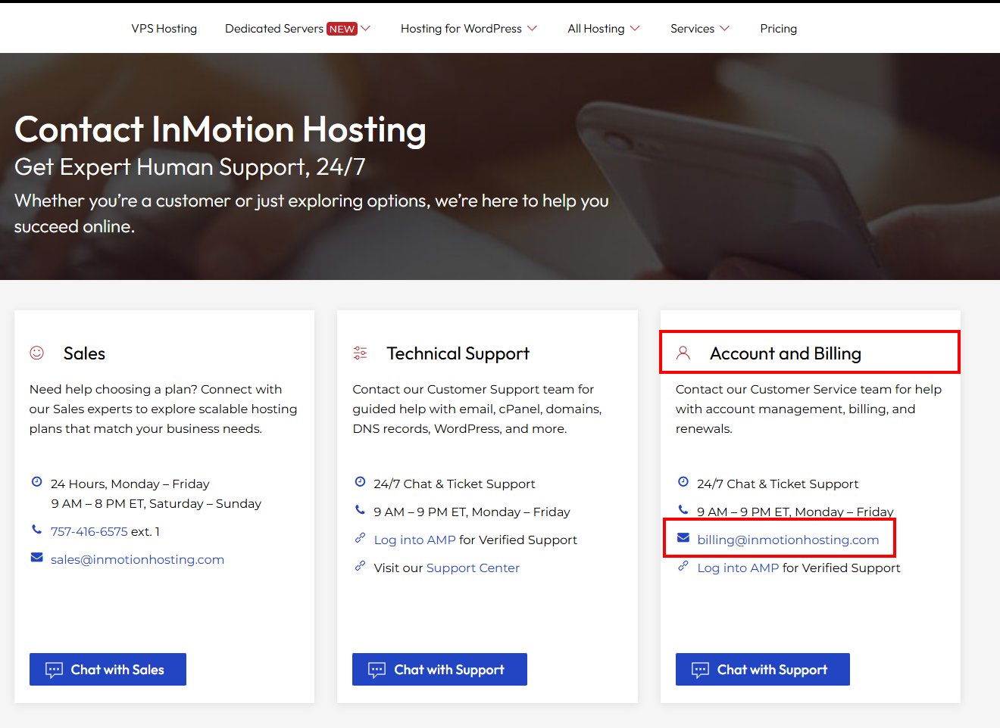
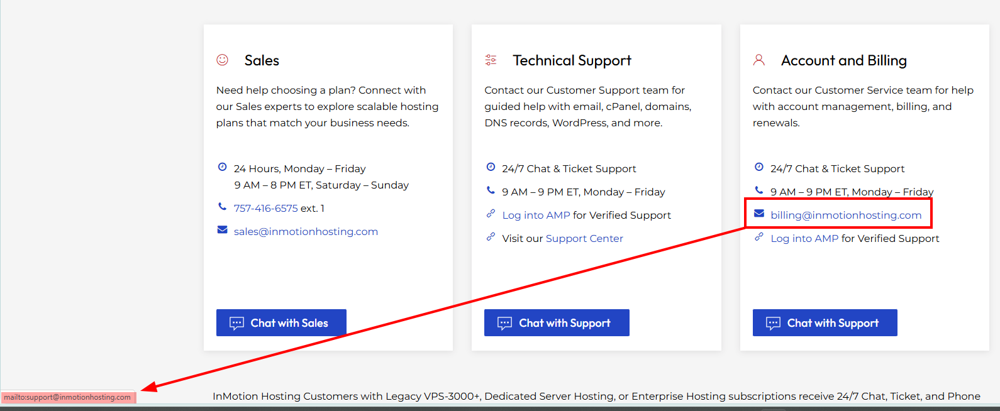
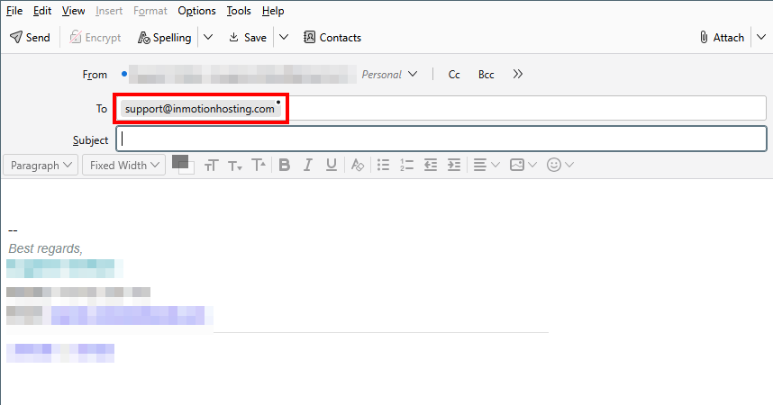

# Bug Report: Account and Billing Email Link Points to Wrong Address

**ID:** IMH-CT-001  
**Reported By:** QA Team  
**Date:** November 2025  
**Status:** Open  
**Component:** Contact Page / Account and Billing Section

## Description
On the **Contact InMotion Hosting** page, the **Account and Billing** section visually displays the email address `billing@inmotionhosting.com`. However, the underlying link is wired to `mailto:support@inmotionhosting.com`.  

This means that when a user clicks the **billing** email link, their email client opens a new message addressed to **support@inmotionhosting.com** instead of **billing@inmotionhosting.com**, which can misroute sensitive billing/account inquiries.

## Environment
- **URL:** [https://www.inmotionhosting.com/contact](https://www.inmotionhosting.com/contact)  
- **Browser:** Chrome (Latest)  
- **OS:** Windows 10/11  
- **Device:** Desktop

## Steps to Reproduce
1. Navigate to the **Contact** page:  
   [https://www.inmotionhosting.com/contact](https://www.inmotionhosting.com/contact)
2. Scroll to the **Account and Billing** section (right-hand column next to "Sales" and "Technical Support").
3. Locate the line showing the email address **`billing@inmotionhosting.com`**.
4. Click on the **`billing@inmotionhosting.com`** link.
5. Observe the **To** field in the new email compose window opened by your default mail client.

## Expected Result
- The visible email text and the underlying link target should match.  
- Clicking the **`billing@inmotionhosting.com`** link should open a new message with:
  - **To:** `billing@inmotionhosting.com`

## Actual Result
- The visible text shows **`billing@inmotionhosting.com`**, but the anchor’s `href` is configured as:
  - `mailto:support@inmotionhosting.com`
- The email compose window opens with:
  - **To:** `support@inmotionhosting.com`

## Severity / Priority
- **Severity:** Medium (functional misrouting of billing/account requests)  
- **Priority:** High (affects contact accuracy for billing and may delay or misdirect sensitive inquiries)

## Screenshots

### Screenshot 0: Contact Us Dropdown

**Description:** Snapshot of the Contact Us dropdown menu showing the "Contact Us" link.

### Screenshot 1: Account and Billing Block

**Description:** Snapshot of the **Account and Billing** block showing the visible `billing@inmotionhosting.com` label.

### Screenshot 2: Billing Email Link Hover

**Description:** Snapshot of the Billing email link when hovered over showing the `mailto:support@inmotionhosting.com` `href`.

### Screenshot 3: Email Link In Mail Client

**Description:** Snapshot of the email compose window opened by the default mail client showing the **To** field set to `support@inmotionhosting.com`.

## Additional Notes
- This appears to be a simple content/link wiring issue in the markup for the Account and Billing email anchor:
  - **Text:** `billing@inmotionhosting.com`  
  - **Href:** `mailto:support@inmotionhosting.com`  
- Fix should update the `href` to `mailto:billing@inmotionhosting.com` to keep label and behavior consistent.

---