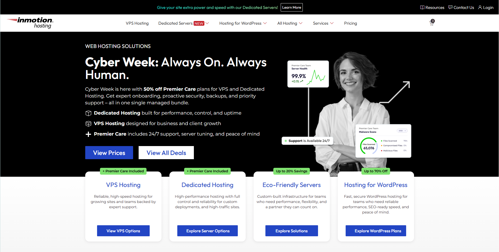
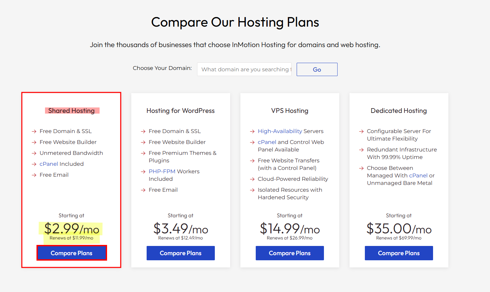
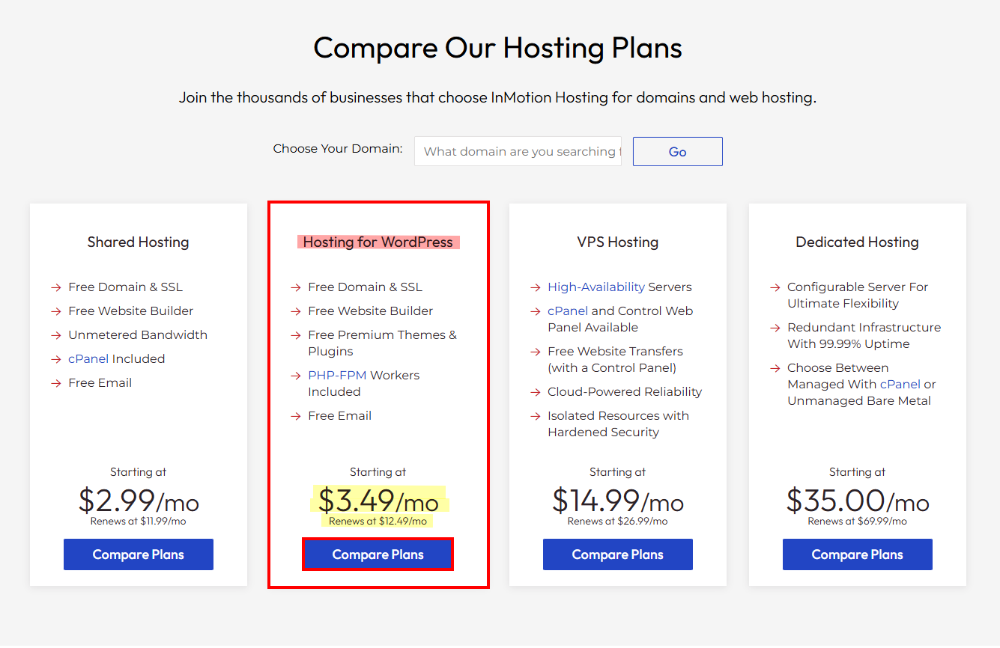
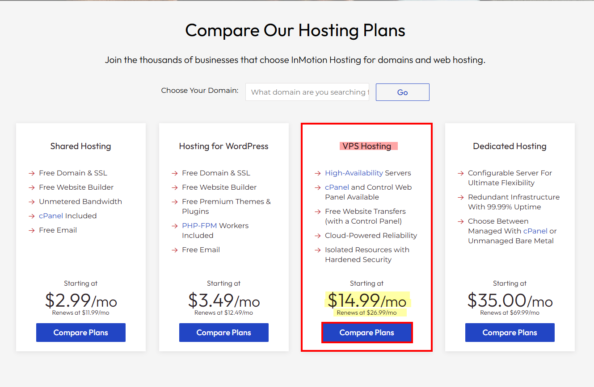
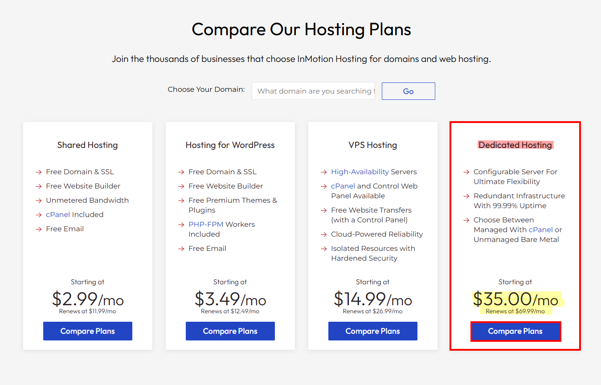

## Test Case TC-PRI-001: Homepage Price Visibility and Structure

**Test Case ID:** TC-PRI-001  
**Test Case Title:** Verify Homepage Price Visibility and Structure  
**Priority:** High  
**Test Type:** Functional / Smoke  
**Component:** Prices Component

### Description
Ensure all major hosting categories display valid starting and renewal prices on the homepage with proper formatting and visibility.

### Pre-conditions
- User has access to a web browser
- User navigates to [https://www.inmotionhosting.com/](https://www.inmotionhosting.com/)
- JavaScript is enabled
- Cookies are accepted

### Test Steps

#### Step 1: Navigate to Homepage
1. Open web browser
2. Navigate to [https://www.inmotionhosting.com/](https://www.inmotionhosting.com/)
3. Wait for page to fully load

**Full homepage view showing the main page content.**

**Screenshot Location:** `screenshots/TC-PRI-001-Step-01.png`

---

#### Step 2: Locate Shared Hosting Card
1. Scroll down the homepage to Compare Our Hosting Plans section.
2. Locate the "Shared Hosting" pricing card
3. Observe the displayed price information

**Close-up of the Shared Hosting section showing the price information.**

**Expected Visual Elements:**
- Price should be prominently displayed
- Currency symbol ($) visible
- Billing period (/mo) clearly indicated

**Screenshot Location:** `screenshots/TC-PRI-001-Step-02.png`

---

#### Step 3: Locate Hosting for WordPress Card
1. Locate the "Hosting for WordPress" pricing card
2. Observe the displayed price information

**Close-up of the Hosting for WordPress section showing the price information.**

**Expected Visual Elements:**
- Price should be prominently displayed
- Currency symbol ($) visible
- Billing period (/mo) clearly indicated

**Screenshot Location:** `screenshots/TC-PRI-001-Step-03.png`

---

#### Step 4: Locate VPS Hosting Card
1. Locate the "VPS Hosting" pricing card
2. Observe the displayed price information

**Close-up of the VPS Hosting section showing the price information.**

**Expected Visual Elements:**
- Price should be prominently displayed
- Currency symbol ($) visible
- Billing period (/mo) clearly indicated

**Screenshot Location:** `screenshots/TC-PRI-001-Step-04.png`

---

#### Step 5: Locate Dedicated Hosting Card
1. Locate the "Dedicated Hosting" pricing card
2. Observe the displayed price information

**Close-up of the Dedicated Hosting section showing the price information.**

**Expected Visual Elements:**
- Price should be prominently displayed
- Currency symbol ($) visible
- Billing period (/mo) clearly indicated

**Screenshot Location:** `screenshots/TC-PRI-001-Step-05.png`

---

### Expected Results
- ✅ Each hosting category section displays a primary promotional price (e.g., "$2.99", "$3.49", "$14.99", "$35.00")
- ✅ Each section displays a renewal price disclaimer (e.g., "Renews at $11.99/mo", "Renews at $12.49/mo", etc.)
- ✅ Currency symbol "$" is present and correctly formatted
- ✅ Billing cycle indicator "/mo" is clearly visible
- ✅ All price text is readable and not truncated
- ✅ Price formatting is consistent across all sections

### Test Data
- **URL:** [https://www.inmotionhosting.com/](https://www.inmotionhosting.com/)
- **Expected Prices:**
  - Shared Hosting: Starting at $2.99/mo, Renews at $11.99/mo
  - WordPress Hosting: Starting at $3.49/mo, Renews at $12.49/mo
  - VPS Hosting: Starting at $14.99/mo, Renews at $26.99/mo
  - Dedicated Hosting: Starting at $35.00/mo, Renews at $69.99/mo

### Pass/Fail Criteria
- **PASS:** All four hosting categories display prices with correct format and renewal disclaimers
- **FAIL:** Any price is missing, incorrectly formatted, or renewal disclaimer is absent

---