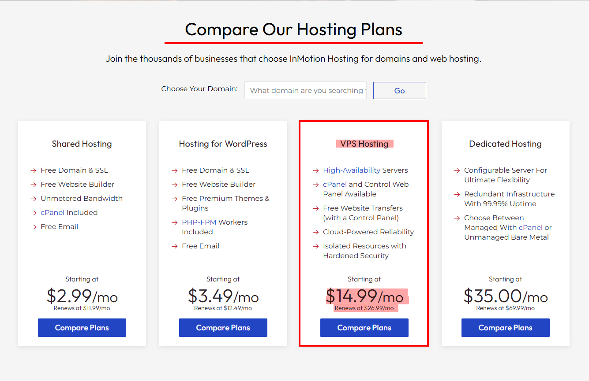
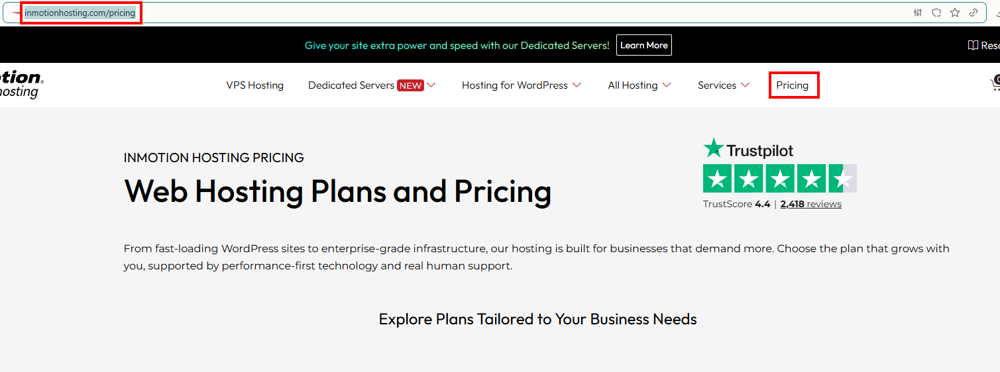
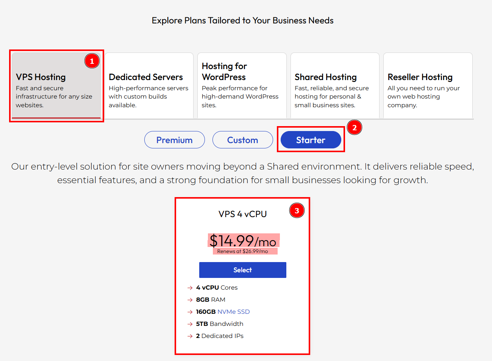
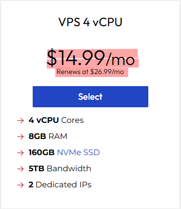

## Test Case TC-PRI-002: Price Consistency Between Home and Pricing Page
**Test Case ID:** TC-PRI-002  
**Test Case Title:** Price Consistency Between Home and Pricing Page  
**Priority:** High  
**Test Type:** Functional / Smoke  
**Component:** Prices Component

### Description
Verify that the "teaser" prices displayed on the homepage match the detailed pricing information on the dedicated pricing page.

### Pre-conditions
- User is on [https://www.inmotionhosting.com/](https://www.inmotionhosting.com/)
- Homepage has fully loaded
- User has noted the VPS Hosting price from homepage

### Test Steps

#### Step 1: Record Homepage VPS Price
1. Navigate to [https://www.inmotionhosting.com/](https://www.inmotionhosting.com/)
2. Scroll down the homepage to Compare Our Hosting Plans section.
3. Locate the "VPS Hosting" pricing card
4. Note the displayed "Starting at" price (Expected: $14.99/mo)
5. Note the displayed "Renews at" price (Expected: $26.99/mo)

**VPS Hosting section on homepage with prices clearly visible.**

**Screenshot Location:** `screenshots/TC-PRI-002-Step-01.png`

---

#### Step 2: Navigate to Pricing Page
1. Locate the "Pricing" link in the top navigation menu
2. Click on "Pricing" link
3. Wait for the pricing page to load

**Top navigation menu with "Pricing" link highlighted/visible.**

**Alternative Navigation:**
- Direct URL: [https://www.inmotionhosting.com/pricing](https://www.inmotionhosting.com/pricing)

**Screenshot Location:** `screenshots/TC-PRI-002-Step-02.png`

---

#### Step 3: Locate VPS Hosting Section on Pricing Page
1. On the pricing page, locate the "VPS Hosting" tab
2. Click on the "Starter" selection button
3. Observe the displayed pricing information

**Full view of the pricing page showing the VPS Hosting section.**

**Screenshot Location:** `screenshots/TC-PRI-002-Step-03.png`

---

#### Step 4: Compare Prices
1. Locate the "Starting at" price for VPS Hosting on the pricing page
2. Compare with the price noted from Step 1
3. Locate the "Renews at" price (Expected: $26.99/mo)
4. Compare with the renewal price noted from Step 1

**Close-up of VPS Hosting pricing table/section showing the price information.**

**Screenshot Location:** `screenshots/TC-PRI-002-Step-04.png`

---

### Expected Results
- ✅ The "Starting at" price on the Pricing page matches the Homepage price exactly ($14.99/mo)
- ✅ The renewal price ($26.99/mo) is visible in the plan details, tooltips, or pricing table
- ✅ No discrepancies exist between homepage and pricing page prices
- ✅ Price format is consistent (same currency symbol, same billing period format)

### Test Data
- **Homepage URL:** [https://www.inmotionhosting.com/](https://www.inmotionhosting.com/)
- **Pricing Page URL:** [https://www.inmotionhosting.com/pricing](https://www.inmotionhosting.com/pricing)
- **Expected VPS Price:** $14.99/mo (promotional), $26.99/mo (renewal)

### Pass/Fail Criteria
- **PASS:** Prices match exactly between homepage and pricing page
- **FAIL:** Any price discrepancy found between the two pages

---