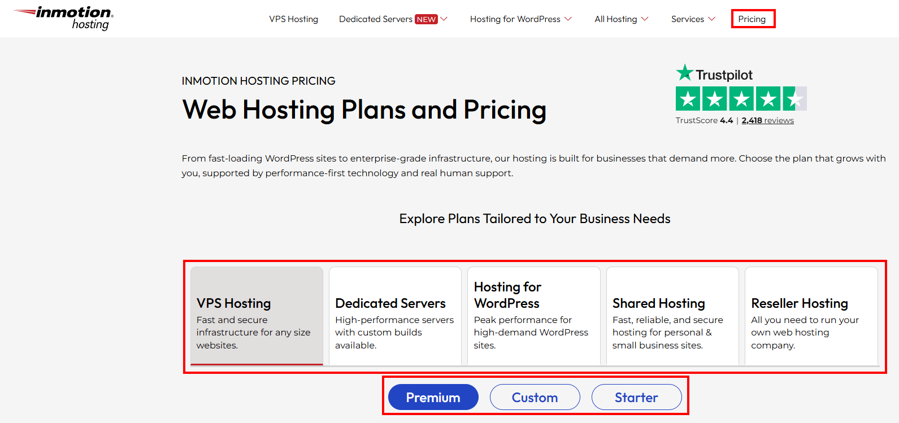
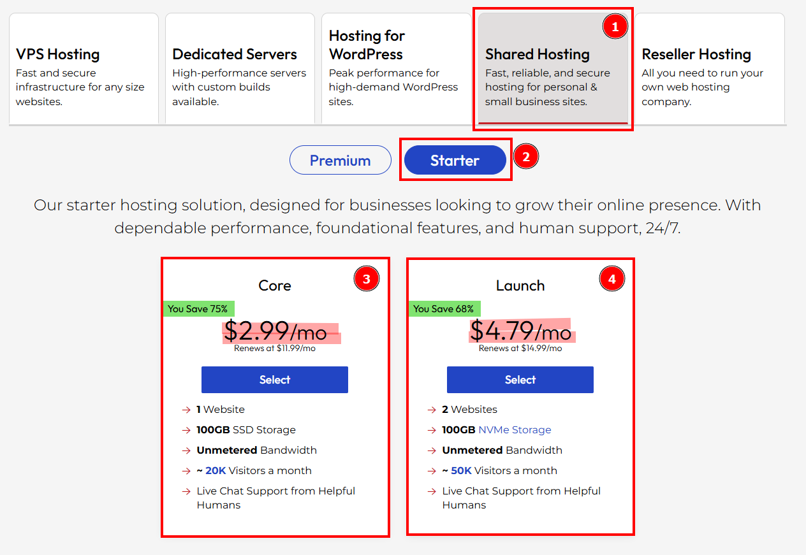
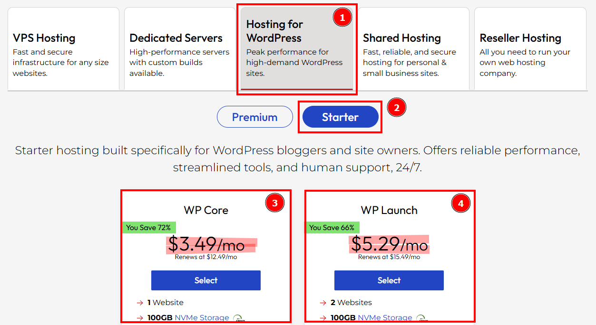
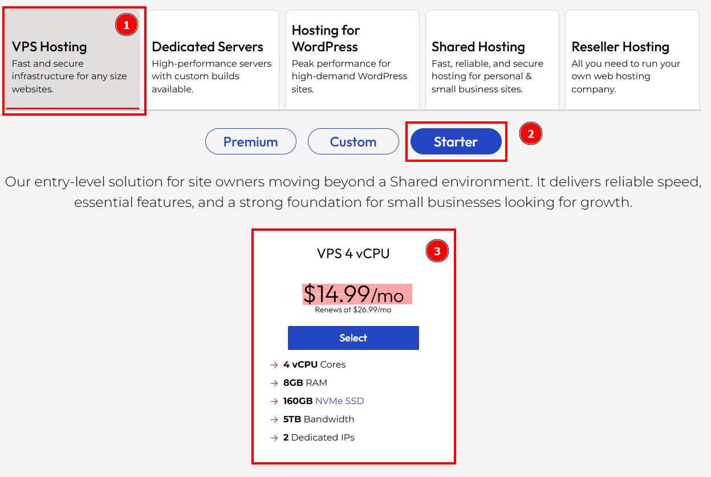
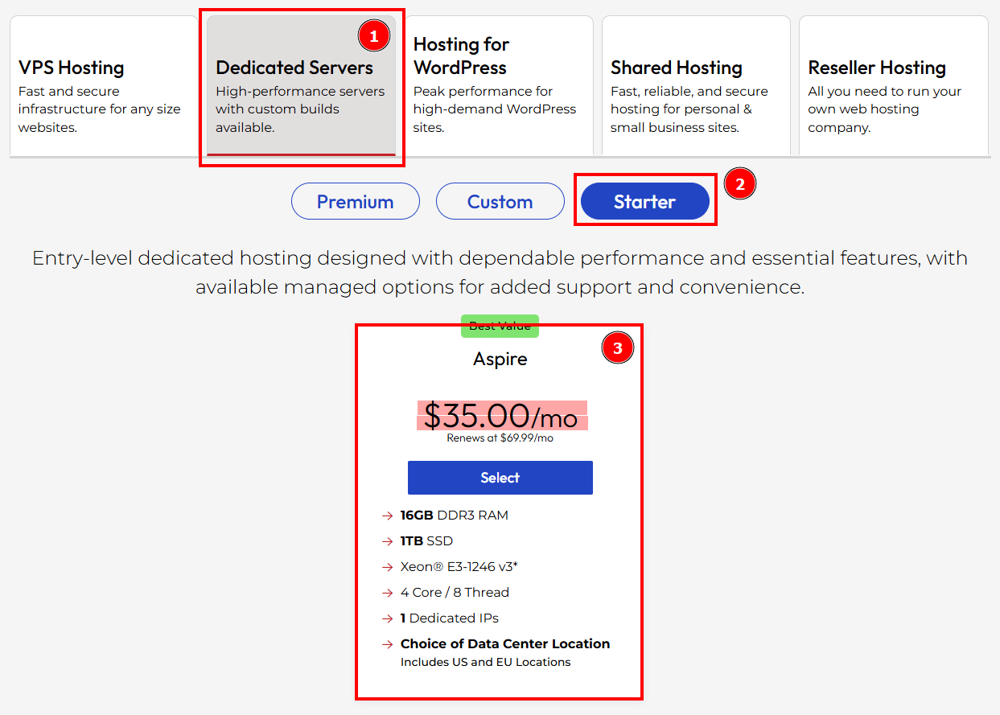
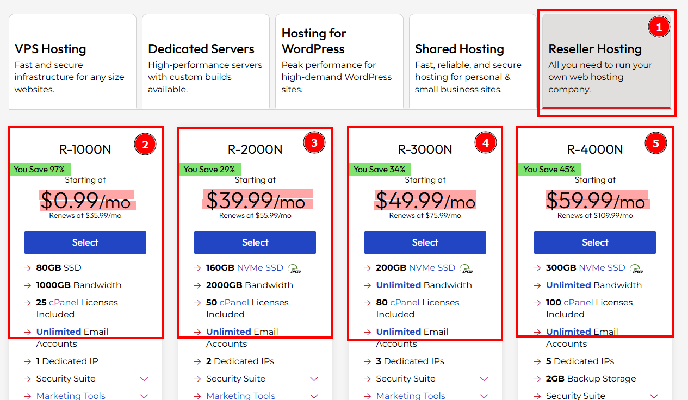
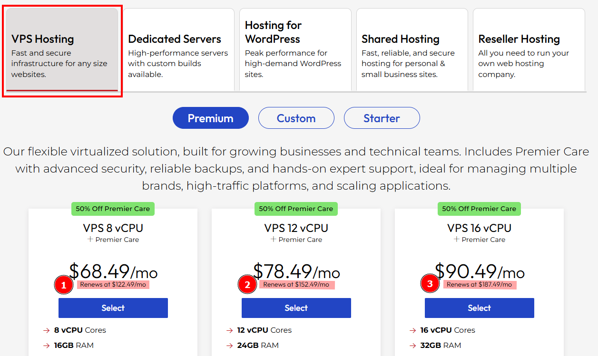

## Test Case TC-PRI-003: Price Format and Currency Validation

**Test Case ID:** TC-PRI-003  
**Test Case Title:** Price Format and Currency Validation  
**Priority:** High  
**Test Type:** Functional / Smoke  
**Component:** Prices Component

### Description
Validate that all prices are properly formatted, non-empty, and follow USD currency standards. Ensure no malformed or missing price data exists.

### Pre-conditions
- User navigates to [https://www.inmotionhosting.com/pricing](https://www.inmotionhosting.com/pricing)
- Pricing page has fully loaded
- All pricing tables/sections are visible

### Test Steps

#### Step 1: Navigate to Pricing Page
1. Open web browser
2. Navigate to [https://www.inmotionhosting.com/pricing](https://www.inmotionhosting.com/pricing)
3. Wait for page to fully load

**Full pricing page view showing all hosting plan sections.**

**Screenshot Location:** `screenshots/TC-PRI-003-Step-01.png`

---

#### Step 2: Inspect Shared Hosting Prices
1. Locate the "Shared Hosting" tab
2. Click on the "Starter" selection button
3. Observe the displayed pricing information
4. Verify format: Should match pattern `$[number]?[number].[number][number]/mo`
5. Check for any empty fields, "NaN", "undefined", or placeholder text
6. Repeat for "Premium" selection button

**Close-up of the Shared Hosting section showing the price information.**

**Price Format Validation:**
- Pattern: `^\$[0-9]?[0-9]+\.[0-9]{2}/mo$`
- Examples: $2.99/mo, $4.99/mo, $9.99/mo

**Screenshot Location:** `screenshots/TC-PRI-003-Step-02.png`

---

#### Step 3: Inspect WordPress Hosting Prices
1. Locate the "Hosting for WordPress" tab
2. Click on the "Starter" selection button
3. Observe the displayed pricing information
4. Verify format: Should match pattern `$[number]?[number].[number][number]/mo`
5. Check for any empty fields, "NaN", "undefined", or placeholder text
6. Repeat for "Premium" selection button

**Close-up of the WordPress Hosting section showing the price information.**

**Screenshot Location:** `screenshots/TC-PRI-003-Step-03.png`

---

#### Step 4: Inspect VPS Hosting Prices
1. Locate the "VPS Hosting" tab
2. Click on the "Starter" selection button
3. Observe the displayed pricing information
4. Verify format: Should match pattern `$[number]?[number].[number][number]/mo`
5. Check for any empty fields, "NaN", "undefined", or placeholder text
6. Repeat for "Custom" and "Premium" selection buttons

**Close-up of the VPS Hosting section showing the price information.**

**Screenshot Location:** `screenshots/TC-PRI-003-Step-04.png`

---

#### Step 5: Inspect Dedicated Servers Prices
1. Locate the "Dedicated Servers" tab
2. Click on the "Starter" selection button
3. Observe the displayed pricing information
4. Verify format: Should match pattern `$[number]?[number].[number][number]/mo`
5. Check for any empty fields, "NaN", "undefined", or placeholder text
6. Repeat for "Custom" and "Premium" selection buttons

**Close-up of the Dedicated Servers section showing the price information.**

**Screenshot Location:** `screenshots/TC-PRI-003-Step-05.png`

---

#### Step 6: Inspect Reseller Hosting Prices
1. Locate the "Reseller Hosting" tab
2. Observe the displayed pricing information
3. Verify format for each plan: Should match pattern `$[number]?[number].[number][number]/mo`
4. Check for any empty fields, "NaN", "undefined", or placeholder text

**Close-up of the Reseller Hosting section showing the price information.**

**Screenshot Location:** `screenshots/TC-PRI-003-Step-06.png`

---

#### Step 7: Verify Renewal Price Disclaimers
1. For each hosting category, verify that renewal prices are displayed
2. Check that renewal prices are clearly distinguished from promotional prices
3. Verify renewal prices follow the same format as promotional prices

**Close-up of the Renewal Price Disclaimers section showing the price information.**

**Screenshot Location:** `screenshots/TC-PRI-003-Step-07.png`

---

### Expected Results
- ✅ All prices follow USD format: `$[number]?[number].[number][number]/mo`
- ✅ No price fields are empty, null, or display "NaN" / "undefined" / "N/A"
- ✅ All prices display currency symbol "$" before the number
- ✅ All prices include billing period indicator "/mo"
- ✅ Renewal prices are clearly visible and distinguished from promotional prices
- ✅ Price formatting is consistent across all hosting categories
- ✅ Decimal places are consistently two digits (e.g., $2.99, not $2.9)

### Test Data
- **URL:** [https://www.inmotionhosting.com/pricing](https://www.inmotionhosting.com/pricing)
- **Valid Price Format Regex:** `^\$[0-9]?[0-9]+\.[0-9]{2}/mo$`
- **Invalid Examples to Check For:**
  - Empty fields
  - "NaN"
  - "undefined"
  - "$0.00/mo" (unless legitimate)
  - Missing currency symbol
  - Missing "/mo" indicator

### Pass/Fail Criteria
- **PASS:** All prices are properly formatted, non-empty, and follow USD standards
- **FAIL:** Any price field is empty, malformed, or doesn't follow the expected format

---