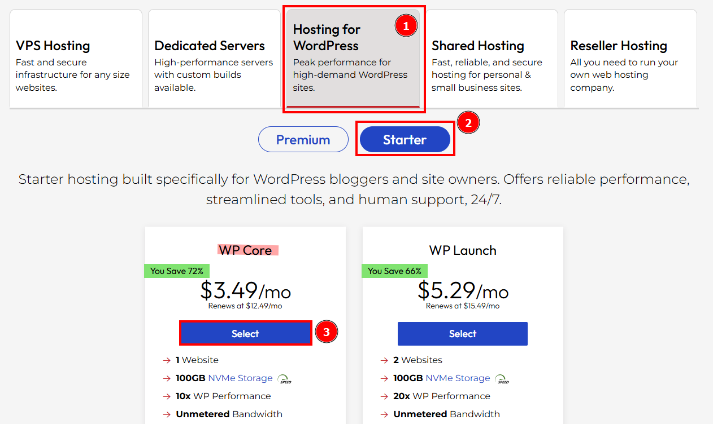
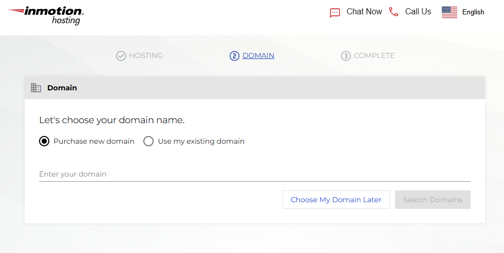
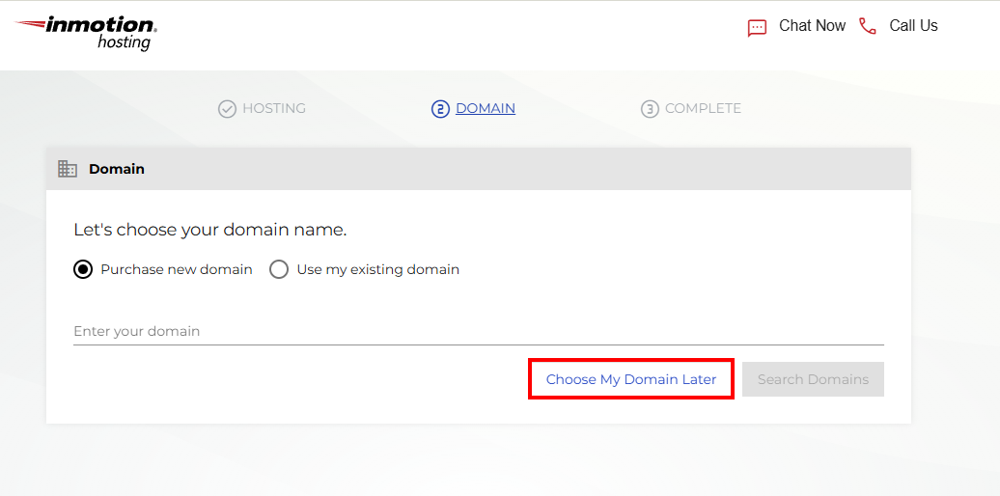
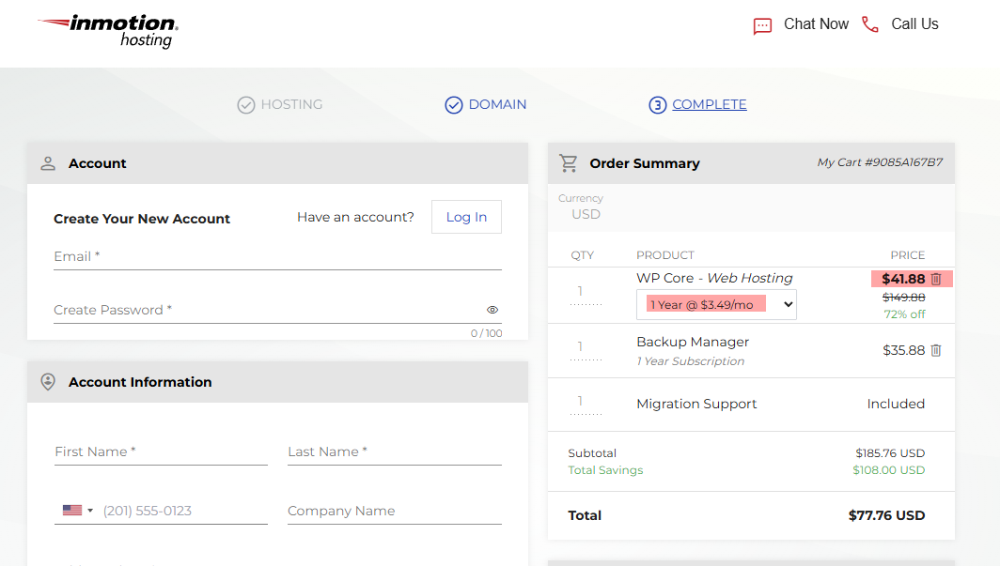

## Test Case TC-PRI-004: Price Persistence Check (Checkout Flow)

**Test Case ID:** TC-PRI-004  
**Test Case Title:** Price Persistence Check (Checkout Flow)  
**Priority:** Critical  
**Test Type:** Functional / Smoke  
**Component:** Prices Component

### Description
Verify that the advertised price persists correctly through the checkout flow, from plan selection through domain selection to the final order summary.

### Pre-conditions
- User is on `https://www.inmotionhosting.com/pricing`
- User has not logged into an account (testing as new customer)
- Cookies are enabled

### Test Steps

#### Step 1: Select WordPress Core Plan
1. Navigate to [https://www.inmotionhosting.com/pricing](https://www.inmotionhosting.com/pricing)
2. Locate the "Hosting for WordPress" section
3. Find the "WP Core" plan
4. Note the displayed price: **$3.49/mo** (promotional)
5. Click the "Select" button for WP Core plan

**Pricing page showing WP Core plan with "$3.49/mo" price and "Select" button visible.**

**Screenshot Location:** `screenshots/TC-PRI-004-Step-01.png`

---

#### Step 2: Verify Redirect to Checkout
1. System should redirect to [central.inmotionhosting.com/amp/checkout](central.inmotionhosting.com/amp/checkout)
2. Wait for checkout page to load
3. Verify you are on the checkout/order page

**Initial checkout page load showing the domain selection step.**

**Screenshot Location:** `screenshots/TC-PRI-004-Step-02.png`

---

#### Step 3: Proceed Through Domain Selection
1. On the domain selection screen, click the "Choose My Domain Later" button
2. Complete page is loaded showing the order summary step.

**Domain selection screen with "Choose My Domain Later" button visible.**

**Screenshot Location:** `screenshots/TC-PRI-004-Step-03.png`

---

#### Step 4: Inspect Order Summary
1. After domain selection, proceed to the next step
2. Locate the "Order Summary" section
3. Observe the displayed pricing information

**Order Summary page showing the selected plan and pricing.**

**Screenshot Location:** `screenshots/TC-PRI-004-Step-04.png`

---

#### Step 5: Verify Plan Price in Order Summary
1. In the Order Summary section, locate the "WP Core - Web Hosting" line item
2. Verify the displayed price matches the $3.49/mo selected in Step 1
3. Verify the yearly price is calculated correctly based on the monthly price (Expected: $3.49/mo * 12 = $41.88/yr)
4. Verify the billing term (monthly, annual, etc.) is correct

**Close-up of Order Summary section showing the selected plan and pricing.**

- Plan name: "WP Core - Web Hosting"
- Price: $3.49/mo
- Total amount: $41.88/yr

**Screenshot Location:** `screenshots/TC-PRI-004-Step-04.png`

---

### Test Data
- **Starting URL:** [https://www.inmotionhosting.com/pricing](https://www.inmotionhosting.com/pricing)
- **Selected Plan:** WP Core
- **Expected Price:** $3.49/mo (promotional rate)
- **Checkout URL Pattern:** [central.inmotionhosting.com/amp/checkout](central.inmotionhosting.com/amp/checkout)

### Pass/Fail Criteria
- **PASS:** Price persists correctly from pricing page through checkout to order summary
- **FAIL:** Price changes unexpectedly, or additional fees appear without user selection

### Notes
- This test may require creating a test account or using guest checkout
- Do not complete the actual purchase unless in a test environment
- Some checkout steps may vary based on user location or account status

---