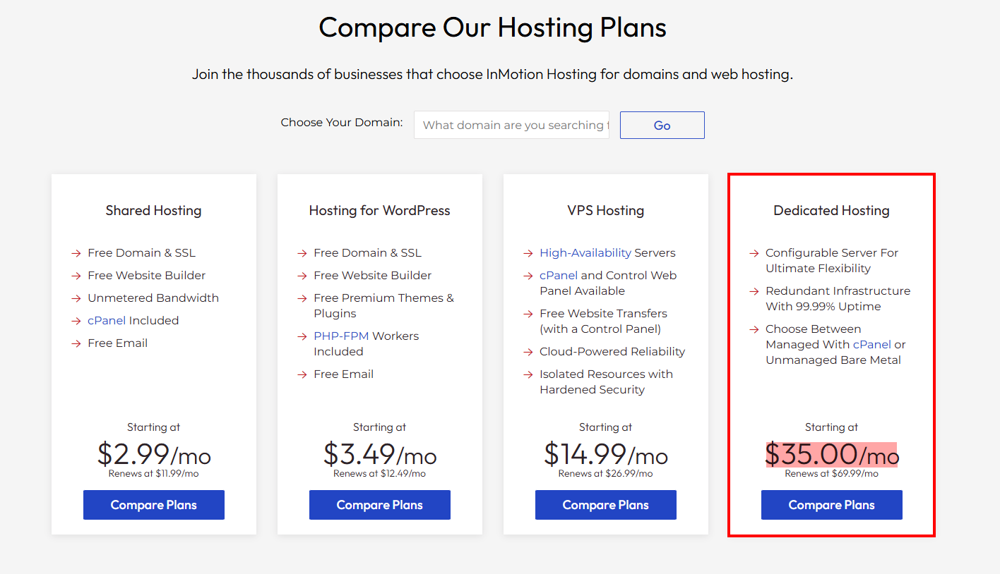
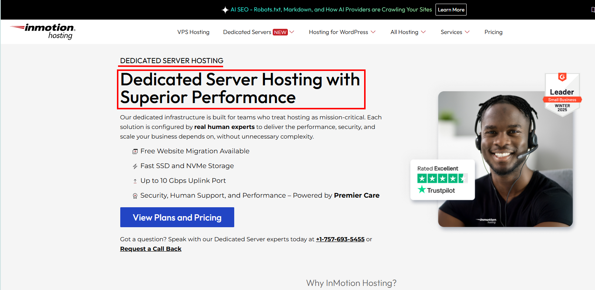
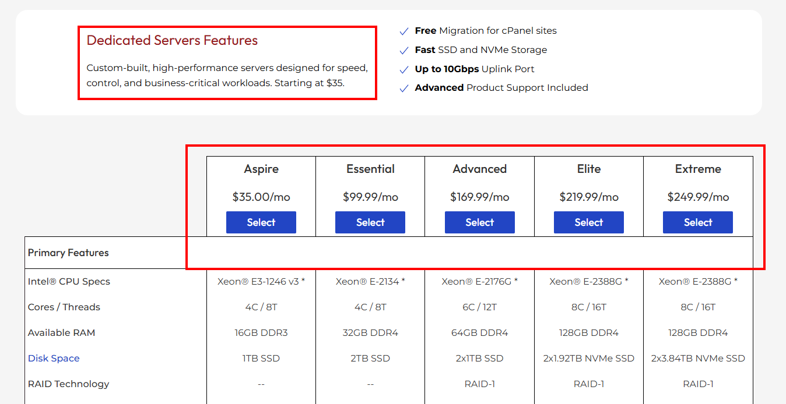
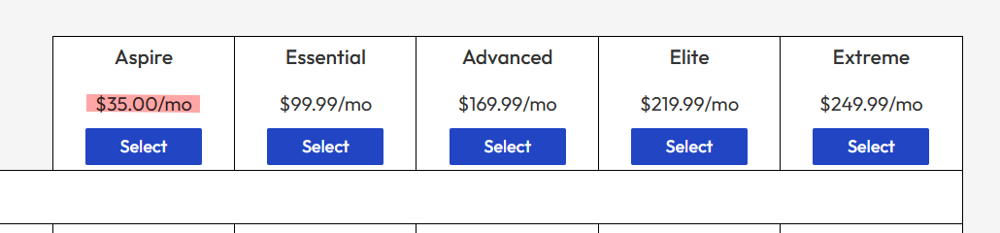

## Test Case TC-PRI-005: Dedicated Hosting "Starting At" Logic

**Test Case ID:** TC-PRI-005  
**Test Case Title:** Dedicated Hosting "Starting At" Logic  
**Priority:** Medium  
**Test Type:** Functional / Smoke  
**Component:** Prices Component

### Description
Verify that the "Starting At" price claim for Dedicated Hosting is accurate and that at least one plan exists at that specific price point.

### Pre-conditions
- User is on [https://www.inmotionhosting.com/](https://www.inmotionhosting.com/)
- Homepage has fully loaded

### Test Steps

#### Step 1: Observe Homepage Dedicated Hosting Price
1. Navigate to [https://www.inmotionhosting.com/](https://www.inmotionhosting.com/)
2. Scroll to the "Dedicated Hosting" section
3. Note the displayed "Starting at" price (Expected: "Starting at $35.00/mo")
4. Record this price for comparison

**Dedicated Hosting section on homepage showing "Starting at $35.00/mo" text.**

**Screenshot Location:** `screenshots/TC-PRI-005-Step-01.png`

---

#### Step 2: Navigate to Dedicated Servers Page
1. Click on the "Compare Plans" button in the Dedicated Hosting section
   - **OR** navigate directly to [https://www.inmotionhosting.com/dedicated-servers](https://www.inmotionhosting.com/dedicated-servers)
2. Wait for the dedicated servers page to load

**Dedicated Servers page showing available plans.**

**Screenshot Location:** `screenshots/TC-PRI-005-Step-02.png`

---

#### Step 3: Locate All Dedicated Server Plans
1. On the dedicated servers page, locate the pricing table or plan comparison section
2. Identify all available dedicated server plans
3. Note the prices for each plan tier (e.g., Aspire, Essential, Advanced, Elite, Extreme)
4. Also check for "Bare Metal" plans if available

**Full pricing table showing all dedicated server plan options with prices.**

**Screenshot Location:** `screenshots/TC-PRI-005-Step-03.png`

---

#### Step 4: Verify Lowest Price Matches "Starting At" Claim
1. Identify the lowest-priced plan in the table
2. Compare this price with the "Starting at" price from Step 1
3. Verify they match exactly

**Close-up of the lowest-priced plan (e.g., "Aspire" plan) showing the price matches $35.00/mo.**

**Screenshot Location:** `screenshots/TC-PRI-005-Step-04.png`

---

### Expected Results
- ✅ At least one dedicated server plan exists at the "Starting at" price ($35.00/mo)
- ✅ The lowest-priced plan matches the "Starting at" claim exactly
- ✅ No plans are priced lower than the "Starting at" claim
- ✅ The "Starting at" price is not misleading (i.e., a plan actually exists at that price)

### Test Data
- **Homepage URL:** [https://www.inmotionhosting.com/](https://www.inmotionhosting.com/)  
- **Dedicated Servers URL:** [https://www.inmotionhosting.com/dedicated-servers](https://www.inmotionhosting.com/dedicated-servers)
- **Expected "Starting At" Price:** $35.00/mo
- **Expected Lowest Plan:** Aspire plan at $35.00/mo

### Pass/Fail Criteria
- **PASS:** A plan exists at the "Starting at" price, and it is the lowest-priced option
- **FAIL:** No plan exists at the "Starting at" price, or a lower-priced plan exists that contradicts the claim

---